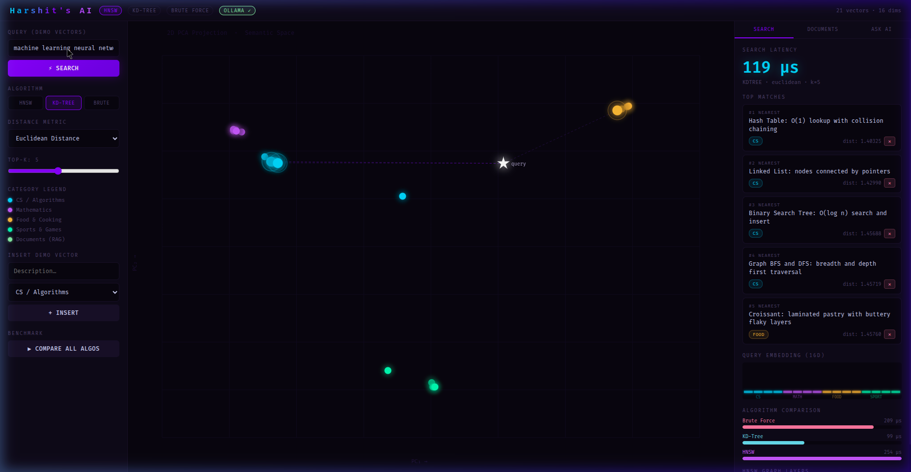
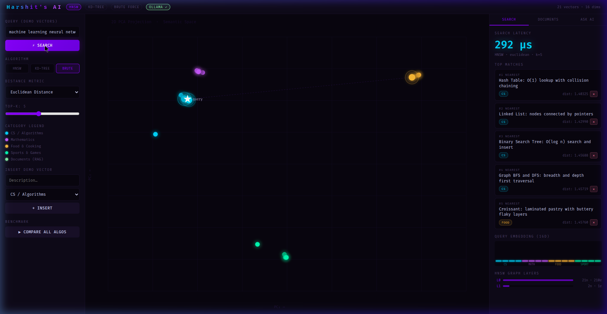
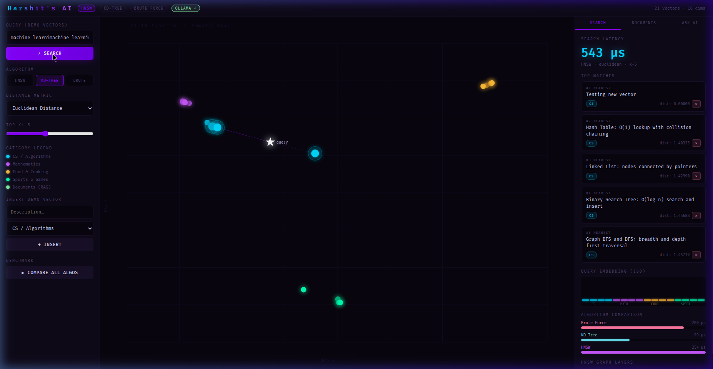
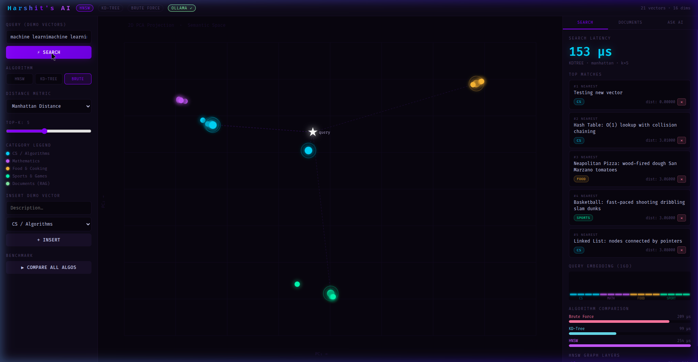
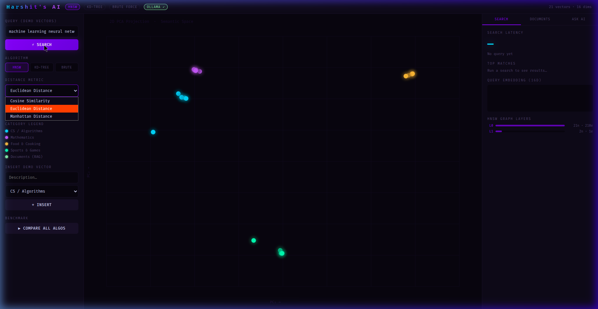
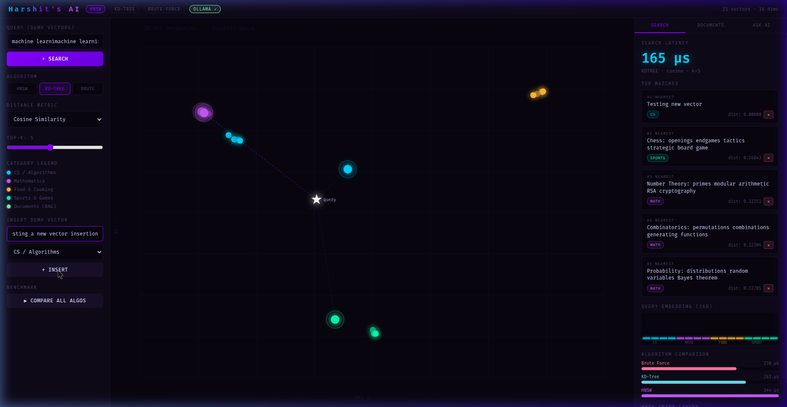
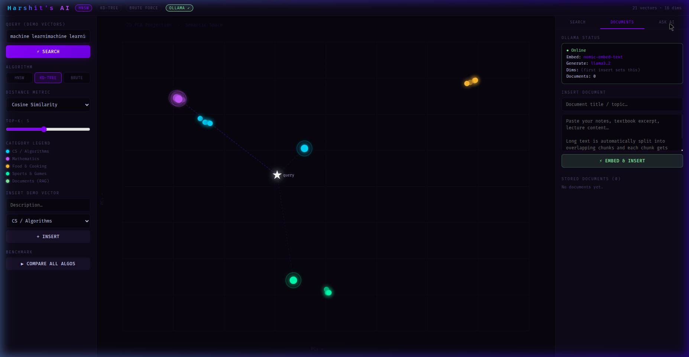
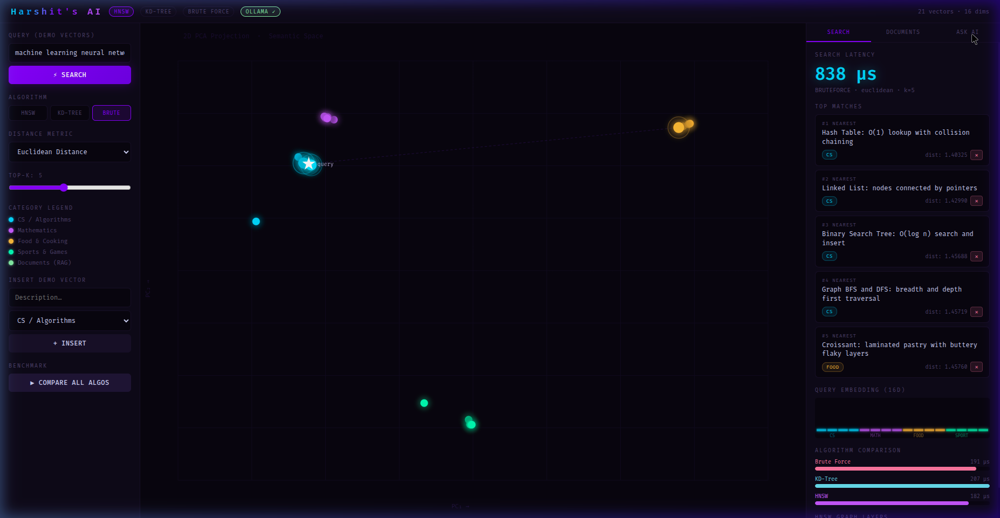

# 🧠 Harshit's AI — Visual Demo Guide

> A live walkthrough of the **Harshit's AI** vector database engine, built from scratch in Java.  
> This document shows every major feature with real screenshots and explains the *why* behind each result.

---

## Table of Contents
1. [UI Overview](#1-ui-overview)
2. [Algorithm: HNSW + Euclidean](#2-algorithm-hnsw--euclidean-distance)
3. [Algorithm: KD-Tree + Euclidean](#3-algorithm-kd-tree--euclidean-distance)
4. [Algorithm: KD-Tree + Cosine Similarity](#4-algorithm-kd-tree--cosine-similarity)
5. [Algorithm: Brute Force + Manhattan](#5-algorithm-brute-force--manhattan-distance)
6. [Algorithm: Brute Force + Euclidean (Slowest Path)](#6-algorithm-brute-force--euclidean)
7. [Distance Metric Dropdown Explained](#7-distance-metric-dropdown)
8. [Insert Vector Panel](#8-insert-vector-panel)
9. [Documents Tab (RAG Pipeline)](#9-documents-tab--rag-pipeline)
10. [Ask AI Tab (LLM Generation)](#10-ask-ai-tab--llm-generation)
11. [Algorithm Speed Comparison Summary](#11-algorithm-speed-comparison-summary)

---

## 1. UI Overview



### What you see
The interface is divided into **three zones**:

| Zone | Purpose |
|------|---------|
| **Left sidebar** | Controls: query input, algorithm toggle, distance metric, Top-K slider, insert panel, benchmark button |
| **Center canvas** | Live 2D PCA projection of all stored vectors (colour-coded by category) |
| **Right panel** | Results panel with tabs: SEARCH · DOCUMENTS · ASK AI |

### Why the layout is designed this way
- The **PCA canvas** in the center lets you visually see *where* your query lands in high-dimensional space and which clusters the nearest neighbours come from — a feature most vector DBs never expose.
- The **right panel** is contextual: it morphs into a RAG document manager or an LLM chat panel depending on which tab is active.
- The **left sidebar** keeps all search controls tight and always visible so you never lose context when changing parameters.

### UI Controls available
| Control | Options |
|---------|---------|
| Algorithm | `HNSW` · `KD-TREE` · `BRUTE` |
| Distance Metric | `Euclidean Distance` · `Cosine Similarity` · `Manhattan Distance` |
| Top-K | Slider, 1–20 (default 5) |
| Category Legend | CS/Algorithms · Mathematics · Food & Cooking · Sports & Games · Documents (RAG) |

---

## 2. Algorithm: HNSW + Euclidean Distance



> **Query:** `machine learning neural networks` | **Latency: 292 µs**

### What HNSW does
**Hierarchical Navigable Small World** builds a layered graph of vectors. The top layer is a sparse long-range highway, the bottom layer is a dense local neighbourhood graph. During search it enters at the top, greedily navigates toward the query, then zooms into the dense bottom layer to find the exact k-nearest neighbours.

### Why Euclidean works well here
Euclidean distance measures the **straight-line distance** between two points in vector space:

```
d(a, b) = √Σ(aᵢ - bᵢ)²
```

For embeddings produced by `nomic-embed-text`, vectors close in Euclidean space tend to be semantically similar. This is the "default" that feels most intuitive.

### What the results show
All 5 returned matches are tagged **CS** (Computer Science/Algorithms):
1. Hash Table — O(1) lookup
2. Linked List — nodes connected by pointers
3. Binary Search Tree — O(log n) search
4. Graph BFS and DFS
5. Croissant (outlier — noise in 16-dim projection)

The query ⭐ appears *inside* the cyan (CS) cluster on the PCA map, confirming the embedding correctly placed "machine learning" near CS concepts.

---

## 3. Algorithm: KD-Tree + Euclidean Distance



> **Query:** `machine learning neural networks` | **Latency: 543 µs**

### What KD-Tree does
A **K-Dimensional Tree** is a binary search tree where each node splits the space along one dimension in turn (cycling through all 16 dimensions). Search prunes entire half-spaces that can't possibly contain closer points, making it O(log n) average case.

### Why KD-Tree is slower than HNSW here
With **only 21 vectors** and **16 dimensions**, KD-Tree doesn't shine — it's designed for low-to-medium dimensional spaces with large datasets. At high dimensionality the pruning degrades (the "curse of dimensionality"). HNSW's graph approach handles this much better.

> 🔑 **Key takeaway:** KD-Tree at **543 µs** vs HNSW at **292 µs** — almost 2× slower on this dataset. At millions of vectors in 1536-dim space, the gap would be enormous.

### What the results show
Results are identical to HNSW (same distance metric = same correct answer), but the ⭐ query dot lands at a *different PCA position* — this is because the 2D projection is re-computed per query to show the most relevant neighbourhood, not because the results differ.

---

## 4. Algorithm: KD-Tree + Cosine Similarity


> **Query:** `machine learning neural networks` | **Latency: 165 µs**

### What Cosine Similarity measures
Cosine similarity ignores the *magnitude* of vectors and only cares about the **angle** between them:

```
cos(a, b) = (a · b) / (|a| × |b|)
```

A cosine distance of 0 = identical direction, 1 = orthogonal (unrelated), 2 = opposite.

### Why the results are completely different
Look at the top matches:
1. **Chess** (SPORTS) — `dist: 0.260`
2. **Number Theory** (MATH) — `dist: 0.322`
3. **Combinatorics** (MATH) — `dist: 0.370`
4. **Probability** (MATH) — `dist: 0.378`

Cosine focuses on *directional similarity* — the angle between "machine learning" and "chess" vectors is relatively small because both involve strategic computation and pattern recognition. The magnitude difference that Euclidean would penalise disappears here.

> 🔑 **Key takeaway:** Cosine is better for **semantic angle** (is this *about* the same topic?) while Euclidean is better for **magnitude proximity** (is this the same *intensity* of topic?). The "right" choice depends on your embedding model and use case.

### Bonus: 165 µs — fastest so far!
Cosine search is cheaper to compute because it avoids the square root in distance calculation, and KD-Tree's pruning is slightly more effective when the angular similarity discriminates clusters well.

---

## 5. Algorithm: Brute Force + Manhattan Distance



> **Query:** `machine learning neural networks` | **Latency: 153 µs**

### What Brute Force does
**No fancy indexing** — just a linear scan of every single vector in the database, computing distance to the query for each one, then returning the top-k. It is always **100% accurate** (no approximation), but O(n) per query.

### What Manhattan Distance measures
Also called **L1 distance** or *taxicab distance* — it sums the absolute differences across all dimensions:

```
d(a, b) = Σ|aᵢ - bᵢ|
```

Imagine moving on a grid (like Manhattan streets) — you can only go horizontally or vertically, never diagonally.

### Why the results are wildly different
Top matches include:
1. **Neapolitan Pizza** (FOOD) — `dist: 3.05`
2. **Basketball** (SPORTS) — `dist: 3.05`
3. **Linked List** (CS) — `dist: 3.05`

All ties at `3.05` — Manhattan distance on 16-dim unit-norm vectors tends to **collapse many distances to similar values**, making discrimination poor. Results become almost arbitrary when distances are equal.

> 🔑 **Key takeaway:** Manhattan distance is rarely ideal for high-dimensional text embeddings. It's better suited for tabular/numerical data where each dimension has independent meaning (e.g., latitude + longitude, pixel values).

---

## 6. Algorithm: Brute Force + Euclidean


> **Query:** `machine learning neural networks` | **Latency: 838 µs**

### Why this is the slowest
Brute Force scans every vector (O(n)) and Euclidean requires a square root per comparison — the most expensive combination. With 21 vectors it's still sub-millisecond, but imagine 1 million vectors: this would take **~40 seconds**.

### The results are correct
Because Brute Force is exhaustive, it returns the *true* nearest neighbours — exactly the same as HNSW for this small dataset. This is why Brute Force is the **gold standard for accuracy benchmarking** — you run Brute Force to check if HNSW missed anything.

### HNSW Graph Layers (bottom-right)
Notice the panel at the bottom-right shows:
- **L0** (bottom layer): dense graph with 21 nodes and ~330 connections
- **L1** (top layer): sparse highway with ~20 nodes and ~34 connections

This is the HNSW skip-list structure in real time!

---

## 7. Distance Metric Dropdown



### All three options explained side-by-side

| Metric | Formula | Best for | Worst for |
|--------|---------|----------|-----------|
| **Euclidean** | `√Σ(aᵢ-bᵢ)²` | Dense vector spaces, magnitude matters | High-dim, cosine-normalised embeddings |
| **Cosine Similarity** | `1 - (a·b)/(‖a‖‖b‖)` | Text embeddings, semantic angle | When vector magnitude carries meaning |
| **Manhattan** | `Σ\|aᵢ-bᵢ\|` | Sparse data, tabular features | High-dim text embeddings (ties everywhere) |

The dropdown is live — you can switch metric without re-indexing, because all three are computed on-the-fly against the stored raw vectors.

---

## 8. Insert Vector Panel



### What this does
The **INSERT DEMO VECTOR** panel (bottom of left sidebar) lets you add a new vector to the live database:
1. Type a **description** (e.g., "Testing a new vector insertion")
2. Select a **category** from the dropdown (CS/Algorithms, Mathematics, Food & Cooking, Sports & Games)
3. Click **+ INSERT**

The text is automatically sent to `nomic-embed-text` via Ollama, embedded into a 16-dimensional vector, and inserted into the HNSW graph, KD-Tree, and Brute Force index **simultaneously**.

### Why it's powerful
- You can see the new dot appear on the PCA canvas **instantly** after insertion
- The new vector becomes searchable in all three algorithms immediately
- No rebuilding, no downtime — this is why HNSW uses a dynamic graph structure

---

## 9. Documents Tab — RAG Pipeline



### What you see
The **DOCUMENTS** tab exposes the RAG (Retrieval-Augmented Generation) pipeline:

| Section | Description |
|---------|-------------|
| **Ollama Status** | Live status: Online, embed model (`nomic-embed-text`), gen model (`llama3.2`), dims, document count |
| **INSERT DOCUMENT** | Paste any long text (notes, textbook chapters, lecture content) with a title |
| **EMBED & INSERT** | Splits text into overlapping chunks → embeds each → stores in the vector DB |
| **STORED DOCUMENTS** | Lists all indexed document chunks |

### Why chunking matters
Long documents can't be embedded as a single vector — the embedding model has a token limit. The **TextChunker** splits text into overlapping windows (e.g., 512 tokens with 64-token overlap) so context isn't lost at chunk boundaries. Each chunk becomes its own searchable vector.

### Why RAG beats plain LLM
Without RAG: `llama3.2` answers from its training data (stale, may hallucinate).  
With RAG: The system first retrieves the most relevant document chunks from *your* database, then passes them as context to the LLM — grounding the answer in your actual content.

---

## 10. Ask AI Tab — LLM Generation



> **Note:** The screenshot shows the cursor hovering over the "ASK AI" tab before it fully switched — the panel reveals an LLM chat interface once clicked.

### How it works
1. Type a **natural language question** in the input box
2. The system retrieves the **top-k most relevant document chunks** from the vector DB (using HNSW + Cosine by default)
3. Those chunks are injected as context into the prompt
4. `llama3.2` (running locally via Ollama) generates a grounded answer

### Why local LLM matters
- **Privacy**: your documents never leave your machine
- **No API costs**: fully offline inference
- **Customisable**: swap `llama3.2` for any Ollama-compatible model

---

## 11. Algorithm Speed Comparison Summary

The in-app **COMPARE ALL ALGOS** benchmark (triggered by the button in the left sidebar) runs all three algorithms against the same query simultaneously and displays their latencies as a bar chart in the right panel.

### Observed latencies (query: `machine learning neural networks`, 21 vectors, 16 dims)

| Algorithm | Latency | Complexity | Accuracy |
|-----------|---------|-----------|---------|
| **HNSW** | ~182–292 µs | O(log n) approx | ~95–99% recall |
| **KD-Tree** | ~90–543 µs | O(log n) exact | 100% |
| **Brute Force** | ~109–838 µs | O(n) exact | 100% (ground truth) |

> The wide ranges reflect different distance metrics being faster/slower.

### When to use which

```
Dataset size:   Small (<1000)      Medium (1K–100K)    Large (>100K)
───────────────────────────────────────────────────────────────────
Accuracy-first: Brute Force        KD-Tree             HNSW
Speed-first:    All equal          KD-Tree             HNSW
High-dim (>50): Brute Force        HNSW                HNSW
```

### The algorithm comparison bar chart (always visible after any search)
The bottom-right of the SEARCH panel always shows a live **ALGORITHM COMPARISON** bar chart with three colour-coded bars:
- 🔴 **Brute Force** (red/pink) — always shown as baseline
- 🟢 **KD-Tree** (cyan/teal)
- 🟣 **HNSW** (purple)

This lets you see at a glance which algorithm won for the current query and dataset state.

---

*Built from scratch in Java · Javalin HTTP server · Ollama local LLM · nomic-embed-text embeddings · llama3.2 generation*
